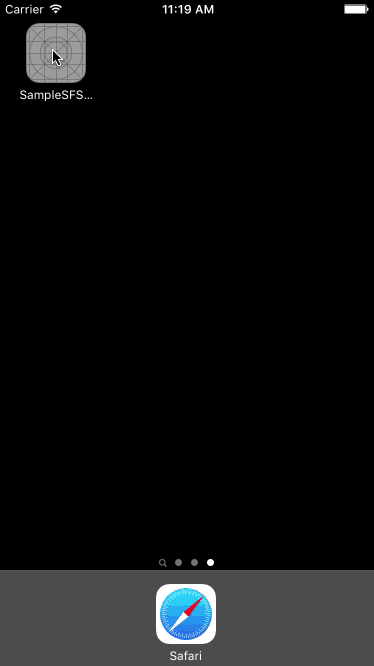

# SampleSFSafariViewController

`SFSafariViewController`の画面遷移を`UINavigationControllr`みたいな push / popで表現できるように実装したサンプルです。

`Qiita API`を使用しています。

## 記事

[【iOS】SFSafariViewControllerをPush / Pop のアニメーションで表示する](http://qiita.com/ryokosuge/items/760b5d9c3aab4759e6cb)

## GIF

