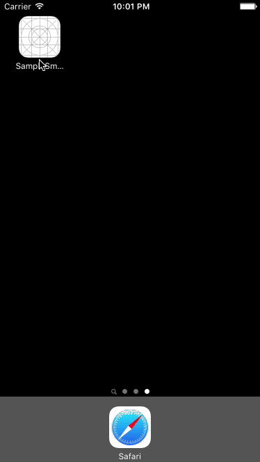

## SampleSmartNewsUI

[iOS Second Stage Advent Calendar 2015](http://qiita.com/advent-calendar/2015/ios-2)の12日目の記事で作成したサンプルになります。

記事は以下のリンクからどうぞ

### 簡単な説明

SmartNewsのTOPのUIを真似てみました。

各Newsは`UIPageViewController`で実装してます。

各Newsのページのスクロールに合わせてHeader周りが動くことが不思議だったのでやってみた次第です。

### GIF

以下のようになります。

